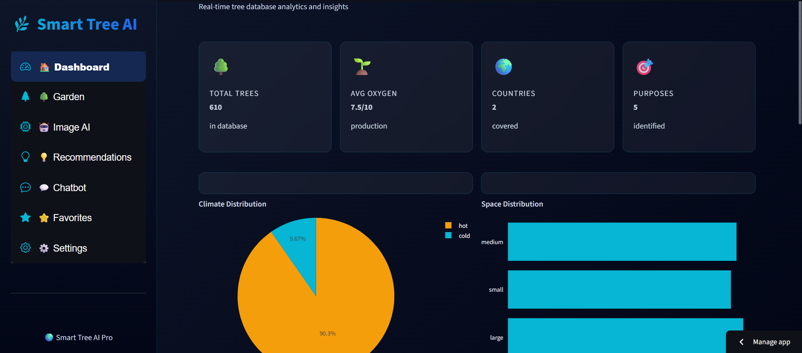
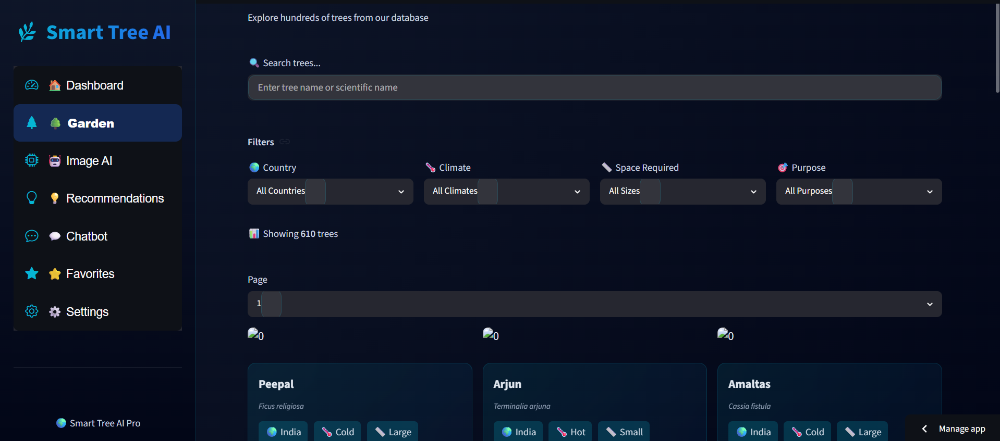
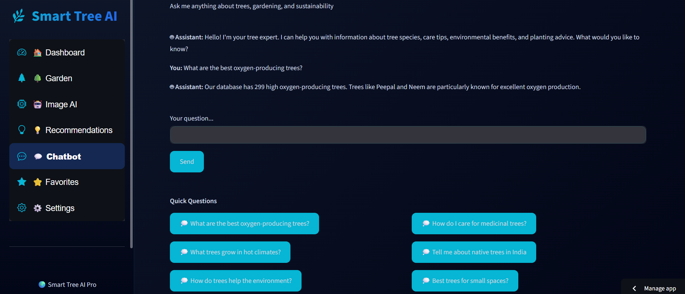
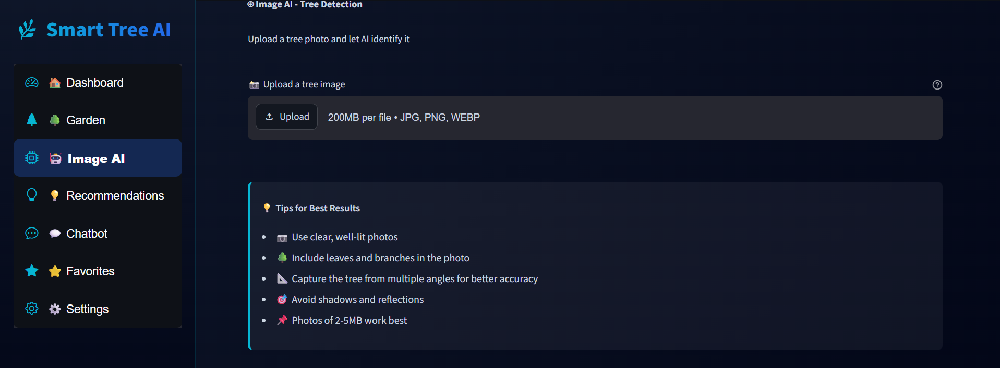

# 🌳 Smart Tree AI

An AI-powered tree recommendation and identification platform that helps users explore tree species, identify trees from images, receive intelligent recommendations, and learn about environmental sustainability through an interactive dashboard.

---

## ✨ Features

- 🌳 Smart Tree Database
- 🤖 AI Tree Identification
- 📷 Image-based Tree Detection
- 💬 AI Tree Chatbot
- 🎯 Personalized Tree Recommendations
- 🔍 Advanced Tree Search & Filters
- 📊 Analytics Dashboard
- 🌍 Climate & Country Filters
- ❤️ Favorite Trees
- ⚙️ User Settings
- 📈 Interactive Data Visualization

---

# 📸 Screenshots

## Dashboard



---

## Garden Explorer



---

## AI Chatbot



---

## Image AI



---

## 🛠 Tech Stack

### Frontend

- Streamlit
- HTML
- CSS

### Backend

- Python

### AI / ML

- Machine Learning
- Computer Vision
- Image Processing

### Database

- CSV Dataset
- Pandas

---

## 📂 Project Structure

```
smart_tree_ai
│
├── components
├── data
├── model
├── utils
├── views
├── app.py
├── config.py
├── prepare_data.py
├── requirements.txt
├── runtime.txt
│
├── screenshots
│   ├── dashboard.png
│   ├── garden.png
│   ├── chatbot.png
│   └── image-ai.png
│
└── README.md
```

---

## 🚀 Installation

Clone repository

```bash
git clone https://github.com/ARADHYA200/smart_tree_ai.git
```

Install dependencies

```bash
pip install -r requirements.txt
```

Run application

```bash
streamlit run app.py
```

---

## 📊 Modules

- Dashboard Analytics
- Tree Explorer
- AI Tree Detection
- Recommendation Engine
- Tree Chatbot
- Favorites
- Search & Filters
- Interactive Visualizations

---

## 🌱 Future Improvements

- YOLO-based Tree Detection
- Voice Assistant
- GPS-based Tree Recommendation
- Weather-aware Recommendations
- Mobile Application
- Multi-language Support

---

## 👨‍💻 Author

**Aradhya Agarwal**

GitHub: https://github.com/ARADHYA200

---

## ⭐ If you like this project, give it a Star!